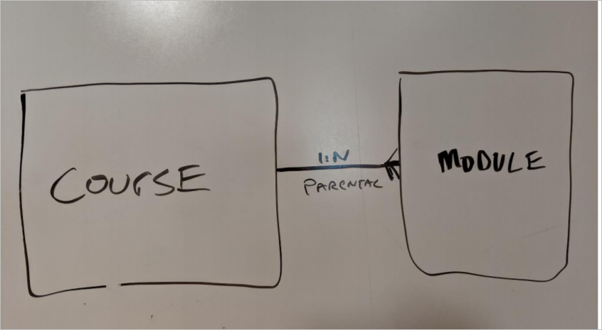
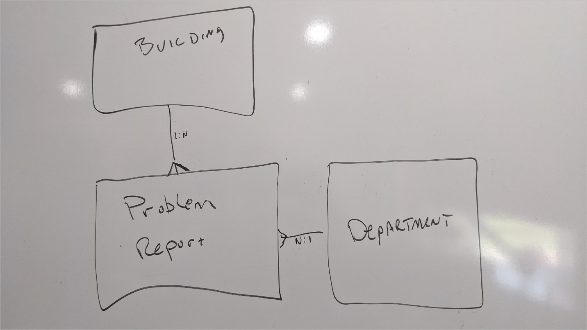
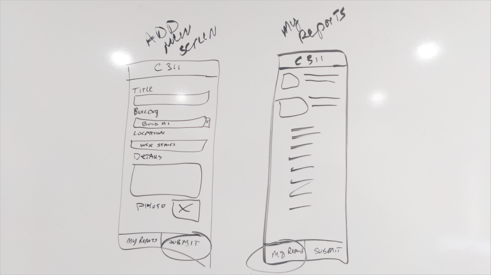

---
Лабораторный практикум:
 заголовок: 'Лабораторная работа 01: Разработка решения'
 модуль: 'Модуль 01: Введение в Power Platform'
---

> [!ПРИМЕЧАНИЕ]
> С ноября 2020 г .:
> - Common Data Service переименована в Microsoft Dataverse. [Подробнее…](https://aka.ms/PAuAppBlog)
> - Обновлена некоторая терминология в Microsoft Dataverse. Например, *entity/объект* теперь *table/таблица*, а *field/поле* теперь *column/столбец*. [Подробнее…](https://go.microsoft.com/fwlink/?linkid=2147247)
>

# Лабораторная работа 01: Разработка решения

В этой лабораторной работе вы превратите свою идею в нечто, что можно реализовать на Power Platform. В рамках этого вы встретитесь с другими людьми в вашей организации, чтобы получить больше ясности о том, как ваша идея может быть реализована. Используя эту информацию, вы определите, какие приложения и средства автоматизации необходимо создать.

## Что вы узнаете

 - Как определить пробелы и требования к идее

 - Как сопоставить проблемную область с Power Platform 

 - Как определить необходимые таблицы для модели данных 

## Лабораторные этапы высокого уровня

 - Упражнение 1 - Обзор сценария 

 - Упражнение 2 - Извлечение потребностей из разговора с коллегой и персоналом учреждения

 - Упражнение 3 - Разработка модели данных

 - Упражнение 4 - Определение необходимых приложений и автоматизации

 - Упражнение 5 - История пользователя, макет пользовательского интерфейса приложения 

## Подробные шаги

### Упражнение 1: Обзор сценария

В этом упражнении вы быстро ознакомитесь со сценарием, который будете строить в этой серии лабораторных работ.

#### Задача 1. Прочтите сценарий.

Прочтите следующий сценарий и отметьте все ключевые моменты, которые, по вашему мнению, могут быть важны позже.

> Вы являетесь сотрудником компании Lamna Healthcare и работаете в отделе биллинга.
> 
> Идя с работы к своей машине, вы заметили, что цифровая вывеска компании у выхода все еще приветствовала участников съезда 2019 года. Вы бы сказали кому-нибудь, но не представляете, кому сказать. Очень часто вы обнаруживаете в своей компании что-то, что нужно исправить, но не имеете возможности никому об этом сказать.
> 
> Когда вы ехали домой в пробке, у вас возникла идея. Что, если бы существовало приложение, с помощью которого можно было бы сообщать о подобных вещах? Вы можете сообщить местоположение, категорию и даже изображение проблемы, чтобы кто-нибудь мог легко найти и исправить ее. Единственная проблема заключалась в вопросе о том, есть ли у вас есть люди, которые будут слушать, если им сообщить о проблемах?
> 
> На следующий день на работе вы встретились со своей подругой из производственного отдела и поделились с ней своей идеей. Она тоже была взволнована этим, потому что на сегодняшний день до сих пор нет скоординированного способа сообщить о подобных проблемах и исправить их. Она объяснила, как часто в них участвуют разные отделы, и их необходимо направлять и отслеживать для того, чтобы узнать статус. Она рассматривала коммерческие варианты, но они оказались слишком сложными и негибкими, изощренными и дорогими. Однако она привела вам пример системы 311, которую города используют для сообщений о проблемах. Основываясь на этом примере, вы решили, что назовете разработку Компанией 311.

### Упражнение 2: Извлеките потребности из разговора

В этом упражнении вы просматриваете текст разговора с несколькими коллегами. В каждом из этих интервью вы делились своей идеей о решении компании 311 и получали отзывы от своих коллег. Вы должны использовать эту информацию, чтобы сформировать дизайн решения.

#### Задача 1: Интервью \#1

Просмотрите следующее обсуждение со своим коллегой и запишите все ключевые вещи, которые вы узнали в ходе взаимодействия. Это интервью дано вашим коллегой из вашего отдела, с которым вы дружите.

> **Вы**: Я хотел узнать ваше мнение об идее компании 311, о которой мы говорили. Я подумываю начать создавать это приложение. Как вы думаете, что нам нужно внести в отчет о проблеме, когда мы его отправляем?
> 
> **Сотрудник**: Вы должны определить, где конкретно проблема - у нас так много зданий. Какой отдел должен это исправить. Ах да, еще фото проблемы.
> 
> **Вы**: Считаете ли вы, что информации о здании достаточно, чтобы определить, где находится проблема?
> 
> **Сотрудник**: Может быть, позволите описать, где конкретно в самом здании...
> 
> **Вы**: Что вы ожидаете после того, как сообщите о проблемах?
> 
> **Сотрудник**: Их, конечно же, исправят\!
> 
> **Вы**: Нет, я имею в виду в приложении, что вы видите после нажатия кнопки «Отправить»?
> 
> **Сотрудник**: Я хочу знать, что кто-то получил это, и над этим работают, а также когда это будет исправлено. На самом деле, не всегда, но большую часть времени ... может быть, я хочу получать уведомления?
> 
> **Вы**: Может быть, список всех отправленных вами позиций?
> 
> **Сотрудник**: Да, было бы здорово\! 
> 
> **Вы**: Отлично, я дам вам знать, когда вы сможете попробовать приложение\!

После того, как вы прочтете это и составите свои заметки, сравните их с нашими заметками в следующем задании, чтобы увидеть, не пропустили ли вы что-нибудь.

#### Задача 2: Интервью \# 1 Примечания

В этом задании вы сравните свои заметки из Интервью \# 1 с нашими заметками.

Ниже приведены наши заметки из интервью \# 1.

 - Необходимо уметь подбирать здание для каждой задачи

 - Необходимо определить, какой отдел должен исправить это, когда вы отправляете сообщение о проблеме

 - Необходимо фото проблемы

 - Требуется произвольное текстовое описание проблемного места в здании.

 - Необходим способ указания того, хотите ли вы получать уведомления о завершении

 - Необходимо видеть все отправленные вами проблемы и их статус

#### Задача 3: Интервью \# 2

Просмотрите следующее обсуждение со своим коллегой и запишите все ключевые вещи, которые вы узнали в ходе взаимодействия. Это интервью дано вашим коллегой из отдела по управлению объектами, с которым вы дружите. Вы полагаете, что большинство сообщений о проблемах будут обрабатываться ими.

> **Вы**: Я хотел узнать ваше мнение об идее компании 311, о которой мы говорили. Я подумываю начать создавать это приложение. Как вы думаете, что необходимо внести в сообщение о проблеме, когда люди его отправляют?
> 
> **Сотрудник**: Максимально подробные детали, фото было бы неплохо. Часто мы получаем отчеты, которые являются лишь очень расплывчатым указанием на проблему, что если бы у нас была картина, она была бы в 1000 раз яснее.
> 
> **Вы**: Что вы думаете о том, чтобы позволить им выбрать, какой отдел, по их мнению, решит проблему?
> 
> **Сотрудник**: Вот это забавно\! Большинство людей понятия не имеют, кто это исправляет, и думают, что это просто волшебство. Я бы посоветовал людям просто отправить отчет о проблеме без отдела, а затем один из сотрудников нашего предприятия назначил бы необходимый для решения данной проблемы отдел.
> 
> **Вы**: Идеально\! Вы устраняете все проблемы, о которых сообщают?
> 
> **Сотрудник**: Многие из них дублируются и не исправляются; другие будут стоить слишком дорого и должны будут получить одобрение менеджера. Если они не утверждены, они не исправляются.
> 
> **Вы**: Как на сегодняшний день вы занимаетесь решением подобного?
> 
> **Сотрудник**: Если я получаю сообщение о проблеме, решение которой, по моему мнению, будет дорогостоящим, я должен попытаться разыскать менеджера для утверждения. И иногда, если я не могу найти его сразу, решение откладывается до тех пор, пока я не вспомню.
> 
> **Вы**: Было бы хорошо, если б мы могли включить возможность утверждения, это могло бы помочь решению. Я дам вам знать, когда вы сможете попробовать приложение\!

После того, как вы прочтете это и составите свои заметки, сравните их с нашими заметками в следующем задании, чтобы увидеть, не пропустили ли вы что-нибудь.

#### Задача 4: Интервью \# 2 Примечания

В этом задании вы сравните свои заметки из Интервью \# 2 с нашими заметками.

Ниже приведены наши заметки из интервью \#2.

 - Фото было бы полезно

 - Отдел не должен быть назначен пользователем, он должен быть назначен специальным сотрудником уже после отправки

 - Требуется утверждение, если стоимость решения превышает определенную сумму денег, было бы полезно автоматизировать

### Упражнение 3: Разработка модели данных

В этом упражнении вы создадите модель данных для поддержки приложений, которые вы будете создавать.

#### Задача 1. Оцените то, что вы уже знаете о данных.

В этой задаче вы оцените информацию, которую вы уже собрали о предлагаемом решении, и попытаетесь определить, какие таблицы данных необходимы и как они связаны. При желании вы можете выполнить эту задачу одновременно со следующей задачей, в которой вы рисуете модель данных.

- Определите основные данные, которыми будет управлять решение. Обычно это одна или две таблицы, на которых сосредоточено ваше приложение. Другие данные обычно связаны с этими таблицами и поддерживают их.

 - Определите связанные таблицы, необходимые для поддержки вашего сценария.

 - Определите, как таблицы должны быть связаны с помощью отношений.
 
 - Оцените, какими должны быть столбцы, и какими - таблицы. Например, как хранить фотографию или место в здании?

#### Задача 2. Нарисуйте черновик модели данных.

Используйте любые доступные вам инструменты; вы можете использовать доску, Visio, PowerPoint, OneNote или даже лист бумаги и ручку. Цель здесь не в том, чтобы добиться идеального изображения, а в том, чтобы позволить вам продумать, как должна выглядеть модель данных, и, возможно, поделиться ею с другими, взамен получив идеи от них. Эта модель данных будет вашим руководством при создании таблиц на портале разработчика. Конечно, вы можете просто начать создавать таблицы на портале, но создание диаграммы помогает обеспечить более тщательное планирование.

1. Нарисуйте свою модель данных, включая отношения и любое поведение в отношениях. Ваш рисунок должен выглядеть так, как в следующем примере, за исключением того, что ваш должен быть предназначен для решения компании 311.
 
 

#### Задача 3. Сравните модели данных

1. Сравните созданную вами в предыдущем задании модель данных, с подготовленной нами. Если есть существенные различия, обсудите их со своим инструктором.

### Упражнение 4. Определение необходимых приложений и автоматизации

В этом упражнении вы изучите собранную информацию и решите, какие приложения и средства автоматизации необходимы для реализации решения. Цель состоит не в том, чтобы идентифицировать каждую функцию приложения или автоматизации, а в том, чтобы определить, нужно ли вам одно приложение или десять, и в каком стиле они должны быть построены.

#### Задача 1. Оценка того, какие приложения необходимы

В этой задаче вы собираетесь посмотреть, как пользователи взаимодействуют с приложениями, и решить, нужно ли вам одно или несколько приложений, и в каком стиле они будут построены, то есть на основе холста или на основе модели. Не существует единственного правильного ответа на вопрос, как этого добиться, но, задав правильные вопросы, вы можете разработать лучшее решение для своих пользователей. Выполняя следующие шаги, делайте заметки о своем решении Компании 311.

1. Определите, кто будет использовать приложение.

2. Определите, как каждая группа пользователей будет получать доступ к приложению. Будет ли это в основном для мобильных устройств или настольных компьютеров?

3. Из общей функциональности, которую вы собираетесь предоставить, есть ли определенные подмножества, которые некоторые пользователи используют постоянно?

4. Существует ли какая-либо функция устройства, доступ к которой предоставляется одному типу приложений в противовес другим?

5. Приложения на основе модели отлично подходят для управления данными. Есть ли какие-либо функции, которые больше подходят для приложения на основе модели?

6. Обдумайте свои ответы на приведенные выше вопросы и запишите, сколько приложений вы будете создавать, типы приложений, а также то, что каждое приложение будет делать и кем оно будет использоваться.

#### Задача 2. Сравните свои заметки о приложениях

В этом задании вы должны сравнить свои заметки из предыдущего задания с нашими подготовленными заметками. Если есть значительные расхождения, обсудите их со своим инструктором.

1. Определите, кто будет использовать приложение:
 
 - Группа 1 - Любой сотрудник в компании
 
 - Группа 2 - Персонал объектов и все сотрудники различных отделов, которые решают проблемы.

2. Для каждой группы пользователей будут ли они получать доступ в основном с мобильных устройств или настольных компьютеров?
 
 - Группа 1 - Наверное, в основном на мобильных устройствах.
 
 - Группа 2 - В основном на компьютерах, но иногда и на мобильных устройствах.

3. Из общей функциональности, которую вы собираетесь предоставить, есть определенные подмножества, которые некоторые пользователи используют постоянно?
 
 - Группа 1 - Самая важная функция - это отправка отчета о проблеме, они ничего не делают для управления списком зданий или отделов.
 
 - Группа 2 - Наиболее важными функциями являются маршрутизация, разрешение отчетов о проблемах и управление справочными данными, связанными со зданиями и отделами.

4. Существует ли какая-либо функция устройства, доступ к которой предоставляется одному типу приложений в противовес другим?
 
 - Простое использование камеры или загрузка фотографий с мобильного устройства

5. Является ли какая-либо из функций дополнительного управления данными более подходящей для приложения на основе модели?
 
 - Управлять справочными данными для зданий и отделов было бы легче в приложении на основе модели.
 
 - Маршрутизация и назначение отчетов о проблемах различным пользователям будет легче обрабатываться в приложении на основе модели.

6. Обдумывая ваши ответы на приведенные выше вопросы, запишите, сколько приложений вы будете создавать, типы приложений, а также то, что каждое приложение будет делать и как оно будет использоваться.
 
 - Приложение 1 - Компания 311 - приложение холста, которое будет использоваться для отправки новых отчетов о проблемах и просмотра списка всех отправленных отчетов о проблемах.
 
 - Приложение 2 - Администратор компании 311 – приложение на основе модели, которое будет использоваться всеми, кто направляет и решает отчеты о проблемах. Это приложение также будет управлять всеми справочными данными, такими как списки зданий и отделов.

### Упражнение 5: История пользователя, макет пользовательского интерфейса приложения

В этом упражнении вы рассмотрите пользовательскую историю, описывающую пользователя, взаимодействующего с приложением, чтобы отправить отчет о проблеме.

#### Задача 1. Пользовательская история

Просмотрите следующую пользовательскую историю:

> Как пользователь я хочу иметь возможность быстро открывать приложение и отправлять отчет о проблеме. Я должен уметь выбирать здание, указывать конкретное место описания проблемы. Приложение должно позволять мне указывать заголовок в одну строку, а также подробную информацию о проблеме. При желании я могу предоставить фото. Я должен иметь возможность легко переключиться и увидеть список уже отправленных мною проблем и их статус.

1. Используя любой из имеющихся у вас инструментов, например, доску, Visio, OneNote или даже лист бумаги и ручку, нарисуйте макет пользовательского интерфейса, чтобы он соответствовал описанной выше пользовательской истории.

2. После того, как вы закончите рисовать макет, переходите к следующему заданию и сравните его с тем, что предоставили мы.

#### Задача 2: Сравнить макет

Ниже приведен пример макета пользовательского интерфейса, показывающий как добавление нового элемента, так и список «Мои отчеты». Нет однозначного ответа на вопрос, как это должно выглядеть, и, возможно, есть много примеров, которые вы могли бы придумать. Цель разметки пользовательского интерфейса - иметь возможность быстро продемонстрировать то, что вы хотите создать, и показать это кому-либо, не создавая на самом деле. В зависимости от инструмента, который вы использовали, вы часто можете быстро вносить изменения по мере развития макета. Разметка используется, чтобы помочь вам быстрее создавать экраны реальных приложений с меньшими переделками.

