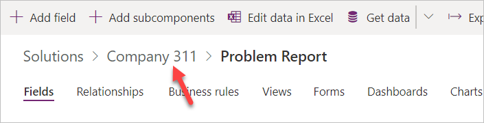
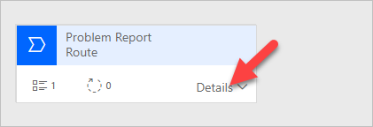
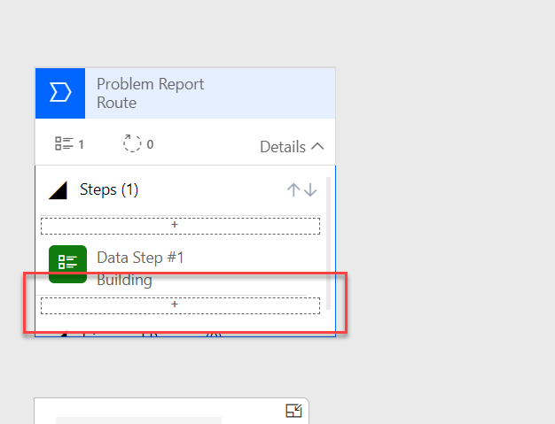
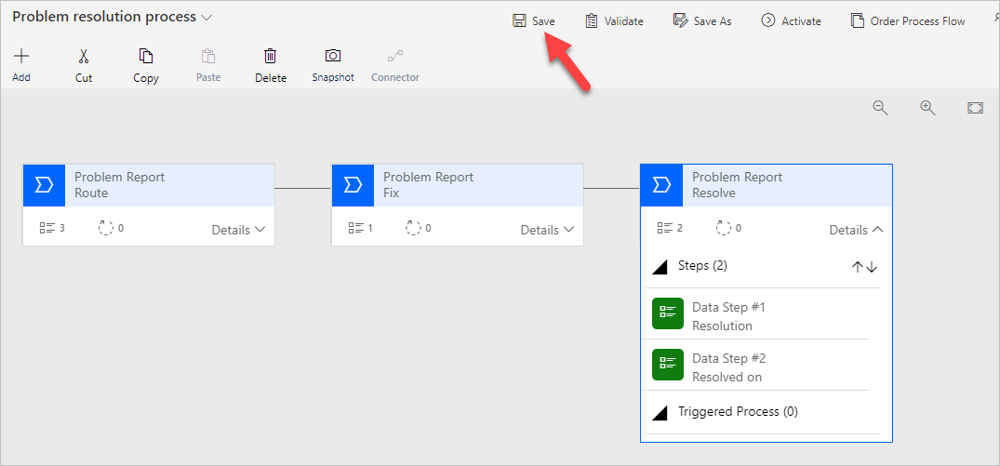
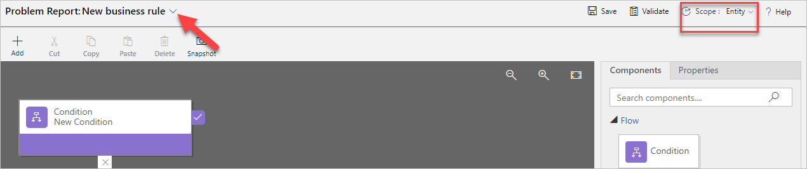
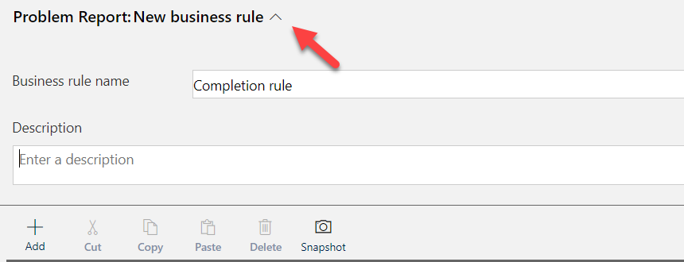
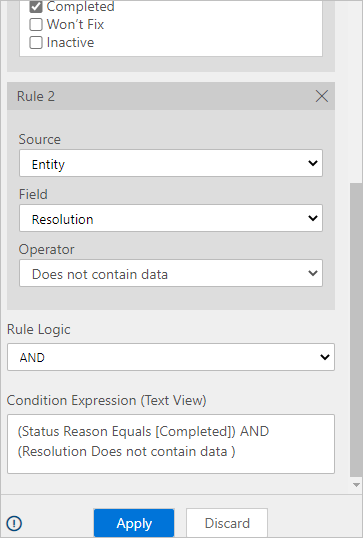
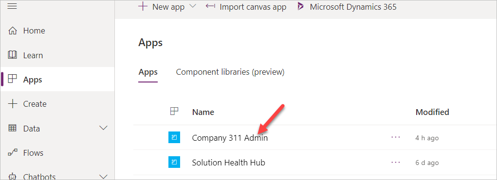
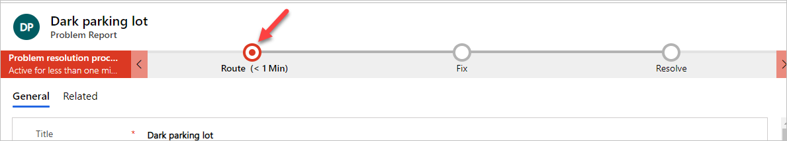
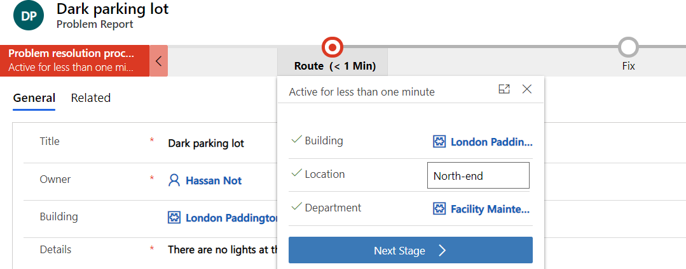

---
Лабораторный практикум:
 заголовок: 'Лабораторная работа 02.2: Потоки бизнес-процессов и бизнес-правила'
 модуль: 'Модуль 02: Создание приложений на основе моделей'
---

> [!ПРИМЕЧАНИЕ]
> С ноября 2020 г .:
> - Common Data Service переименована в Microsoft Dataverse. [Подробнее…](https://aka.ms/PAuAppBlog)
> - Обновлена некоторая терминология в Microsoft Dataverse. Например, *entity/объект* теперь *table/таблица*, а *field/поле* теперь *column/столбец*. [Подробнее…](https://go.microsoft.com/fwlink/?linkid=2147247)
>

# Лабораторная работа 02.2: Потоки бизнес-процессов и бизнес-правила

В этой лабораторной работе вы усовершенствуете модель данных и улучшите поведение приложения, добавив последовательность бизнес-процессов и бизнес-правила.

## Что вы узнаете

 - Как определить этапы в потоке бизнес-процессов (BPF)

 - Как создать и использовать BPF

 - Как использовать бизнес-правила для реализации логики

## Лабораторные этапы высокого уровня

 - Упражнение 1. Создание отчета о жизненном цикле BPF для отчета о проблеме.
 
 - Маршрут 
 
 - Исправление 
 
 - Решение 

 - Упражнение 2 - Бизнес-правило, запрещающее закрытие без разрешения

## Предварительные требования

* Должно быть выполнено **Лабораторная работа 02.1: Модель данных и приложение на основе модели**

## Подробные шаги

### Упражнение 1. Создание последовательности бизнес-процессов

В этом упражнении вы создадите последовательность бизнес-процессов для таблицы отчетов о проблемах.

#### Задача 1. Настроить таблицу

В этой задаче вы добавите столбец подстановки в таблицу отчета о проблеме.

1. Перейдите на страницу [Портал разработчика Power Apps](https://make.powerapps.com/) и убедитесь, что вы находитесь в правильной среде.

2. Выберите **Решения** и щелкните, чтобы открыть решение **Компания 311**.

3. Найдите и щелкните, чтобы открыть таблицу **Отчет о проблеме**.

4. Убедитесь, что у вас есть вкладка **Столбцы**, и нажмите **+ Добавить столбец**.

5. Введите **Назначить** для **Отображаемое имя**, выберите **Поиск** для **Тип данных**, выберите **Пользователь** для **Связанная таблица** и нажмите **Готово**.

6. Щелкните **Сохранить таблицу**.

7. Вернитесь к решению, щелкнув имя решения.

8. Щелкните **Опубликовать все настройки** и дождитесь завершения публикации.

#### Задача 2: Создание последовательности бизнес-процессов

В этой задаче вы создадите последовательность бизнес-процессов для таблицы отчетов о проблемах.

1. Перейдите на страницу [Портал разработчика Power Apps](https://make.powerapps.com/) и убедитесь, что вы находитесь в правильной среде.

2. Выберите **Потоки**.

3. Выберите вкладку **Потоки бизнес-процессов** и нажмите **+ Создать**.

4. Введите **Процесс разрешения проблемы** для **Имя потока**, выберите **Отчет о проблеме** для **Таблица** и нажмите **Создать**.

5. Выберите **Новый этап**, перейдите на панель **Свойства**, измените **Отображаемое имя** на **Маршрут** и нажмите **Применить**.

6. Разверните **Подробности** этапа **Маршрут**.

7. Выберите **Шаг данных \#1**, перейдите на панель **Свойства**, выберите **Здание** для **Поле данных** и нажмите **Применить**.

8. Нажмите **+ Добавить** и выберите **Добавить шаг данных**.

9. Выберите параметр **+**, чтобы добавить шаг данных ниже шага данных **Строительство**.

 

10. Выберите новый шаг данных, перейдите на панель **Свойства**, выберите **Местоположение** для **Поле данных** и нажмите **Применить**.

11. Снова нажмите **+ Добавить** и выберите **Добавить шаг данных**.

12. Выберите новый шаг данных, перейдите на панель **Свойства**, выберите **Отдел** для **Поле данных** и нажмите **Применить**.

13. Этап **Маршрут** теперь должен выглядеть как на изображении ниже.

14. Нажмите **+ Добавить** и выберите **Добавить этап**.

15. Добавьте новый этап после этапа **Маршрут**.

16. Выберите этап, перейдите на панель **Свойства**, введите **Исправить** для **Отображаемое имя** и нажмите **Применить**.

17. Разверните **Подробности** этапа **Исправление**.

18. Выберите **Шаг данных \#1** на стадии **Исправление**.

19. Перейдите на панель **Свойства**, выберите **Назначить** для **Поле данных** и нажмите **Применить**.

20. Нажмите **+ Добавить** и выберите **Добавить этап**.

21. Добавьте новый этап после этапа **Исправить**.

22. Выберите новый этап, перейдите на панель **Свойства**, введите **Разрешение** для **Отображаемое имя** и нажмите **Применить**.

23. Разверните **Подробности** этапа **Разрешение**.

24. Выберите **Шаг данных \#1** на стадии **Разрешение**.

25. Перейдите на панель **Свойства**, выберите **Разрешение** для **Поле данных** и нажмите **Применить**.

26. Нажмите **+ Добавить** и выберите **Добавить шаг данных**.

27. Добавьте новый шаг данных под шагом данных **Разрешение**.

28. Выберите новый шаг данных, перейдите на панель **Свойства**, выберите **Разрешено** для **Поле даты** и нажмите **Применить**.

29. Теперь последовательность бизнес-процессов должна выглядеть, как показано на рисунке ниже. Нажмите **Сохранить**.

30. Щелкните **Активировать**.

31. Еще раз нажмите **Активировать** во всплывающем окне.

32. Убедитесь, что в нижнем левом углу экрана **Статус: активен**.

 

33. Закройте окно или вкладку браузера редактора процессов.

#### Задача 3: Добавление последовательности бизнес-процессов в решение

В этой задаче вы добавите созданную вами последовательность бизнес-процессов в решение «Компания 311».

1. Перейдите на страницу [Портал разработчика Power Apps](https://make.powerapps.com/) и убедитесь, что вы находитесь в правильной среде.

2. Выберите **Решения** и щелкните, чтобы открыть решение **Компания 311**.

3. Нажмите **+ Добавить существующее** и выберите **Обработка**.

4. Найдите проблему, выберите **Процесс решения проблемы** и нажмите **Добавить**.

5. Щелкните **Опубликовать все настройки** и дождитесь завершения публикации.

### Упражнение 2: Создание бизнес-правила

В этом упражнении вы создадите бизнес-правило, которое будет блокировать выполнение проблем без разрешения.

#### Задача 1. Создание бизнес-правила

1. Перейдите на страницу [Портал разработчика Power Apps](https://make.powerapps.com/) и убедитесь, что вы находитесь в правильной среде.

2. Выберите **Решения** и щелкните, чтобы открыть решение **Компания 311**.

3. Найдите и щелкните, чтобы открыть таблицу **Отчет о проблеме**.

4. Выберите вкладку **Бизнес-правила** и нажмите **Добавить бизнес-правило**.

5. Убедитесь, что для **Область** установлено значение **Объект**, и нажмите **Показать подробности** шеврона.

6. Измените **Название бизнес-правила** на **Завершение правила** и нажмите **Скрыть подробности** шеврона

7. Выберите **Условие**.

8. Перейдите на панель **Свойства** и измените **Отображаемое имя** на **Требуемое разрешение**.

9. Прокрутите вниз до **Правило 1**, выберите **Причина состояния** для **Поле**, выберите **Равно** для **Оператор**, выберите **Значение** для **Тип**, выберите **Завершено** для **Значение** и нажмите **Применить**.

10. Нажмите **+ Создать**.

11. Прокрутите вниз до **Правило 2**, выберите **Разрешение** для **Поле**, выберите **Не содержит данных** для **Оператор**, убедитесь, что выбрано **И**. для **Логика правил** и нажмите **Применить**.

12. Нажмите **+ Добавить**.

13. Выберите **Добавить показывать сообщение об ошибке**.

14. Добавьте действие на **истинный** путь условия.

15. Выберите новое действие, перейдите на панель **Свойства**, введите **Показать сообщение** для **Отображаемое имя**, выберите **Причина состояния** для **Поле**, введите **Проблема должна быть решена, прежде чем ее можно будет закрыть** для **Сообщение** и нажмите **Применить**.

16. Бизнес-правило должно выглядеть так, как показано на рисунке ниже. Нажмите **Сохранить**.

17. Щелкните **Активировать**.
18. Еще раз нажмите **Активировать** во всплывающем окне.
19. Подтвердите активацию.
20. Закройте окно или вкладку обозревателя редактора процессов.
21. Нажмите **Готово**.

### Упражнение 3: Процессы тестирования

В этом упражнении вы протестируете последовательность бизнес-процессов и созданное вами бизнес-правило.

#### Задача 1. Тестовые процессы

1. Перейдите на страницу [Портал разработчика Power Apps](https://make.powerapps.com/) и убедитесь, что вы находитесь в правильной среде.

2. Выберите **Приложения** и щелкните, чтобы открыть приложение **Администратор компании 311**.

3. Выберите **Отчеты о проблемах** и нажмите **+ Создать**.

4. Вы должны увидеть этапы бизнес-процесса. Введите **Темная парковка** для **Заголовок**, выберите **Лондонский Паддингтон** для **Здание**, введите **В северной части парковки нет света** для **Подробности** и нажмите **Сохранить**.

5. Щелкните на этап **Маршрут**.

6. Введите **Северный конец** для **Местоположение**, выберите **Техническое обслуживание объекта** для **Департамент** и выберите **Следующий этап**.

 > [!ПРИМЕЧАНИЕ]
 >
 > Если параметр «Следующий этап» не отображается, обновите страницу.
 
 

7. Выберите пользователя для **Назначить** и нажмите **Следующий этап**.

8. Выберите дату и время для **Разрешено** и оставьте значение **Разрешение** пустым.

9. Прокрутите вниз до раздела сведений о разрешении и выберите **Завершено** для **Причина состояния**. Вы должны увидеть сообщение об ошибке бизнес-правила.

10. Предоставьте **Разрешение**. Сообщение об ошибке должно исчезнуть.

11. **Сохраните** строку.

Нажмите **Далее**, чтобы перейти к следующей лабораторной работе.
