---
Лабораторный практикум:
 заголовок: 'Лабораторная работа 07: Тестирование и развертывание'
 модуль: 'Модуль 07: Тестирование и развертывание'
---

> [!ПРИМЕЧАНИЕ]
> С ноября 2020 г.:
> - Common Data Service переименована в Microsoft Dataverse. [Подробнее…](https://aka.ms/PAuAppBlog)
> - Обновлена некоторая терминология в Microsoft Dataverse. Например, *entity/объект* теперь *table/таблица*, а *field/поле* теперь *column/столбец*. [Подробнее…](https://go.microsoft.com/fwlink/?linkid=2147247)
>

# Лабораторная работа 07: Тестирование и развертывание

В этой лабораторной работе вы завершите настройку решения, добавив роли безопасности для пользователей. Затем вы проверите, протестируете и развернете решение в производственной среде.

## Что вы узнаете

 - Как развернуть решение в другой среде

## Лабораторные этапы высокого уровня

  - Упражнение 1. Создание ролей безопасности для пользователей. 
 
      - Пользователь компании 311 – Доступ к чтению Здания, пользователь привязан к отчетам о проблемах 
 
      - Администратор компании 311 - Полный доступ к зданиям, отделам, отчетам о проблемах 
 
      - Свяжите роль администратора компании 311 с приложением на основе модели 

  - Упражнение 2 - Запуск средства проверки решения

  - Упражнение 3. Использование Test Studio для создания тестового примера для отправки проблемы (можно не включать изображение)

  - Упражнение 4 - Решение для экспорта и импорта
 
  - Упражнение 5: Добавление существующего потока к решению

## Предварительные требования

* Должно быть выполнено **Лабораторная работа 02.1: Модель данных и приложение на основе модели **

## Подробные шаги

### Упражнение 1. Создание ролей безопасности

В этом упражнении вы создадите роли безопасности для пользователей.

#### Задача 1. Создание ролей безопасности

1. Перейдите на [портал разработчика Power Apps](https://make.powerapps.com/) и убедитесь, что вы находитесь в правильной среде.
2. Выберите **Решения** и щелкните, чтобы открыть решение **Компания 311**.
3. Нажмите **+ Создать** и выберите **Другое**, а затем выберите **Роль безопасности**.
4. Введите **Пользователь Компании 311** в поле **Имя Роли** и выберите вкладку **Пользовательские Объекты**.
5. Установите право чтения таблицы **Здание** на **Организацию**.
6. Установите право чтения таблицы **Отчет о проблеме** на ** Пользователе**.
7. Права на чтение таблиц **Здание** и **Отчет о проблеме** теперь должны выглядеть, как показано на рисунке ниже. Нажмите **Создать новое сохранение**.

 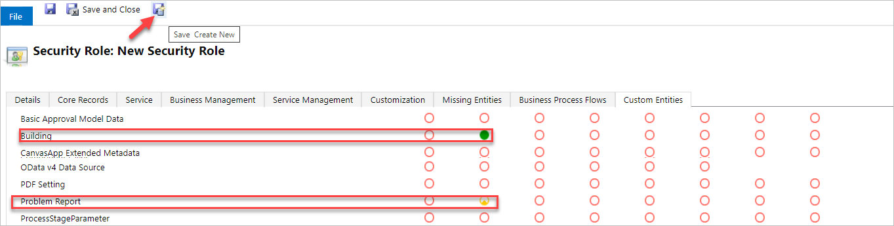

8. Введите **Администратор компании 311** для **Имя роли** и выберите вкладку **Пользовательские объекты**.

9. Установите для всех привилегий таблиц **Здание**, **Отдел** и **Отчеты о проблемах** значение **Организация**.

 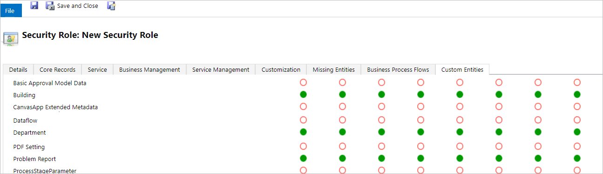

10. Выберите вкладку **Настройки**.
11. Установите все привилегии для **Приложения на основе модели**.

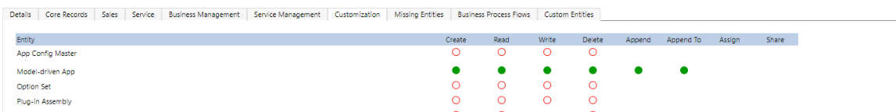

12. Нажмите **Сохранить и закрыть**.
13. Во всплывающем окне нажмите **Готово**.
14. Выберите **Решения**.
15. Щелкните **Опубликовать все настройки** и дождитесь завершения публикации.

### Упражнение 2: Проверка решения

В этом упражнении вы запустите средство проверки решения для решения Компания 311.

#### Задача 1. Запуск средства проверки решений

1. Убедитесь, что вы по-прежнему находитесь на сайте [портал разработчиков Power Apps](https://make.powerapps.com/) и находитесь в правильной среде.

2. Выберите **Решения**, выберите **Решение компании 311**, щелкните **Средство проверки решений** и выберите **Выполнить**.

 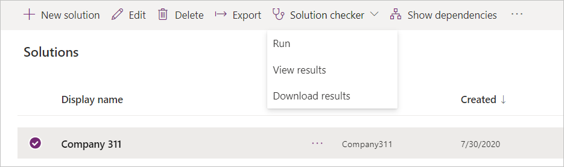

3. Средство проверки решения должно начать проверку вашего решения, дождитесь его завершения. Значение столбца проверки решения изменится на Результаты с отметкой времени.

4. **Обновите** страницу и снова выберите решение, щелкните **Средство проверки решений** и выберите **Просмотреть результаты**.

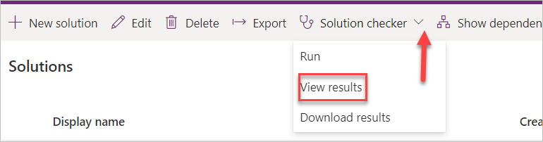

5. Просмотрите результаты проверки решения и убедитесь, что проблем нет.

 > [!ПРИМЕЧАНИЕ]
 >
 > Если вы видите ошибки в результатах проверки решения, откройте компонент, отображающий ошибки одну за другой, и устраните проблемы.
 >
> На этом этапе вы увидите ошибки для приложений холста. Откройте оба приложения одно за другим и исправьте оцениваемую метку и ошибку индекса вкладки. Для получения помощи вы можете обратиться к [документации Microsoft](https://docs.microsoft.com/en-us/powerapps/maker/canvas-apps/accessibility-checker). После решения проблем сохраните и опубликуйте свое приложение. Вернитесь к решению и повторно запустите средство проверки решения.
 >
 > Пользователи с нарушениями зрения, слуха или другими нарушениями могут более легко и успешно использовать ваше приложение холста, если вы учитываете специальные возможности при разработке внешнего вида и поведения приложения.

### Упражнение 3. Использование тестовой студии

В этом упражнении вы используете тестовую студию для создания тестового примера для отправки отчета о проблеме.

#### Задача 1. Создать тестовый пример

1. Перейдите на [портал разработчика Power Apps](https://make.powerapps.com/) и убедитесь, что вы находитесь в правильной среде.

2. Выберите **Приложения**, выберите **Мобильное приложение Компании 311** и нажмите **Изменить**. При появлении запроса выберите **Пропустить**.


3. Щелкните **Файл** и выберите **Настройки**.

4. Выберите **Предстоящие функции**.

5. Выберите вкладку **Экспериментальный** и включите **Управление ошибками на уровне формулы**.
6. Закройте панель настроек.
 
    Примечание. В настоящее время тестовая студия не может записывать шаги внутри такого компонента, как элемент управления вкладками, который мы используем, вы редактируете формулу Приложения При запуске, поэтому приложение переходит непосредственно к новому экрану отчета.

7. Выберите меню **Древовидное представление**.

8. Выберите **Приложение** и выберите **При запуске**.
9. Добавьте приведенную ниже формулу к существующей формуле.

    ```; Navigate('New Reports Screen')```


10. Щелкните **Файл** и выберите **Сохранить**.

11. Щелкните **Опубликовать**.

12. Выберите **Опубликовать эту версию** и дождитесь завершения публикации.

13. Нажмите кнопку **Назад**, чтобы вернуться в конструктор приложения.

14. Выберите вкладку **Дополнительные инструменты** и выберите **Открыть тесты**.

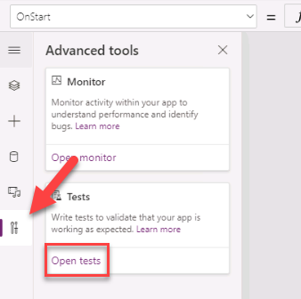

15. Щелкните **многоточие** в **Обращение** и выберите **Переименовать**.

16. Переименуйте обращение в **Отправить отчет о проблеме**.

17. Щелкните **Запись**.

18. Вы должны увидеть вкладку **Новый отчет**.

19. Заполните форму и нажмите **Отправить**.

20. Нажмите кнопку **Готово** в нижнем левом углу экрана.

21. Вы должны увидеть список записанных шагов. Нажмите **Запуск**.


22. Нажмите **Опубликовать** и дождитесь завершения публикации.

23. Шаги должны воспроизводиться правильно. Нажмите **Готово**.

24. Закройте окно или вкладку обозревателя тестовой студии.

25. Закройте окно или вкладку браузера конструктора приложений.


### Упражнение 4: Импорт и экспорт

В этом упражнении вы экспортируете решение компании 311 и импортируете его в новую среду.

#### Задача 1: Экспорт решения

1. Перейдите на [портал разработчика Power Apps](https://make.powerapps.com/) и убедитесь, что вы находитесь в правильной среде.

2. Выберите **Решения** и щелкните, чтобы открыть решение **Компания 311**.
3. Нажмите **+ Добавить существующий** и выберите **Ссылка на подключение**.


4. Выберите все ссылки на подключение и нажмите **Добавить**.
5. Щелкните **Опубликовать все настройки** и дождитесь завершения публикации.
7. Щелкните **Экспорт**.


8. Щелкните **Далее**.
9. Выберите **Управляемый** и нажмите **Экспорт**.

10. Сохраните решение на свой компьютер.

11. Снова нажмите **Экспорт**.

12. Нажмите **Далее**.

13. Выберите **Неуправляемое**, измените **версию** в соответствии с версией управляемого решения и нажмите **Экспорт**.

14. У вас должны быть экспортированы управляемые и неуправляемые версии решения.

#### Задача 2: Создание новой среды и импорт решения

1. Перейдите на [страницу плана сообщества Power Apps](https://powerapps.microsoft.com/en-us/communityplan/)
2. Щелкните **Существующий пользователь? Добавьте среду разработки**.
3. Введите свои учетные данные, когда будет предложено войти в систему.
4. Выберите свою страну в раскрывающемся меню и нажмите **Принять**.
5. Перейдите в [Центр администрирования Power Platform](https://admin.powerplatform.microsoft.com/environments), чтобы увидеть, что система создала новую среду. Мы будем называть ее средой «Prod» до конца этого курса (имя среды будет «Среда» <имя вашей учетной записи>).
6. Перейдите на [портал разработчика Power Apps](https://make.powerapps.com/) и выберите только что созданную среду.
7. Выберите **Решения** и нажмите **Импорт**.
8. Щелкните **Выбрать файл**.
9. Выберите экспортированное управляемое решение и нажмите **Открыть**.

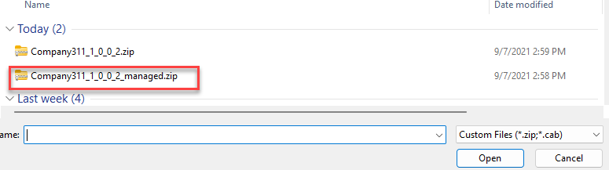

10. Щелкните **Далее**.
11. Еще раз нажмите **Далее**.
12. Щелкните **Выбрать соединение** для Outlook, а затем щелкните **+ Новое соединение**.


13. Откроется новое окно. Нажмите **Создать**.
14. Предоставьте свои **учетные данные**.
15. Закройте окно или вкладку браузера подключений.
16. Щелкните **Обновить**.
17. Повторите шаги 12–16 для остальных соединений.
18. Щелкните **Импорт** и дождитесь завершения импорта.
19. Щелкните **Опубликовать все настройки** и дождитесь завершения публикации.
20. Щелкните, чтобы открыть только что импортированное решение **Компания 311**.
21. Просмотрите компоненты решения.
22. Выберите **Приложения** и убедитесь, что у вас есть и приложение холста, и приложение на основе модели.
23. Щелкните, чтобы открыть приложение **Администратор компании 311**.
24. Приложение должно загрузиться без проблем.
25. Закройте окно или вкладку браузера приложения администратора компании 311.
26. Щелкните, чтобы открыть **Мобильное приложение Компания 311**.
27. Приложение должно загрузиться без проблем.
28. Закройте окно или вкладку браузера **Мобильного приложения Компания 311**.


### Упражнение 5: Добавьте существующий поток в решение

Сотрудник создал простой поток личной продуктивности. Поток выглядит очень полезным дополнением для всех в компании, поэтому было принято решение сделать этот поток доступным для всех, включив его в существующее решение.
В этом упражнении вы создадите поток вне решения, а затем добавите его в решение Компания 311.


#### Задача 1. Создайте команду
В этом задании вы создадите команду Lunchtime Sports.

1. Перейдите в [Microsoft Teams](https://teams.microsoft.com/).
2. Выберите **Команды** и нажмите **Присоединиться или создать команду**.


3. Щелкните **Создать команду**.
4. Выберите **С нуля**.
5. Выберите **Публикация**.
6. Введите **Lunchtime Sports** в поле "Название команды" и нажмите **Создать**.
7. Щелкните **Пропустить**.

#### Задача 2: Создайте поток
В этой задаче вы создадите поток, который будет запускаться, когда кто-то будет добавлен в группу «Lunchtime Sports», поток отправит вам уведомление и скажет вам узнать, каким видом спорта будет заниматься новый участник.

1. Перейдите на [портал разработчика Power Apps](https://make.powerapps.com/) и убедитесь, что вы находитесь в правильной среде (среде вашей практики).
2. Выберите **Потоки**.
3. Нажмите **+ Новый поток** и выберите **Автоматизированный облачный поток**.


4. Щелкните **Пропустить**.
5. Найдите группы и выберите **При добавлении или удалении участника группы** Office 365.


6. Нажмите **Войти**.
7. Предоставьте свои учетные данные.
8. Выберите **Lunchtime Sports** для идентификатора группы и нажмите **+ Новый шаг**.
9. Выберите **Условие**.
10. Щелкните левое поле значения и выберите **@удалено** на панели динамического содержимого.
11. Выберите **равно** во втором поле значения, для третьего поля значения выберите вкладку **Выражение**, введите **null** и нажмите **ОК**.


12. Перейдите в ветку **Если да** и нажмите **Добавить действие**.
13. Найдите **получить профиль пользователя** и выберите **Получить профиль пользователя (V2)**.
14. Щелкните поле «Пользователь (UPN)» и выберите **ID пользователя** на панели динамического содержимого.

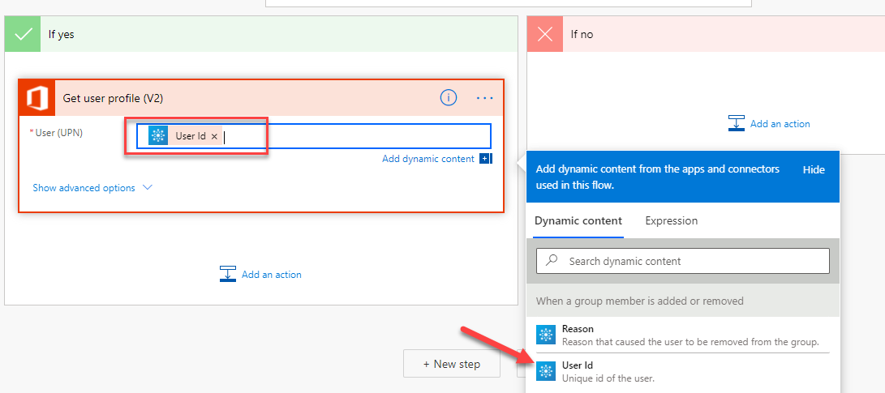

15. Еще раз нажмите **Добавить действие**.
16. Найдите **отправить** и выберите **Отправить мне уведомление по электронной почте**.
17. Введите **Новый участник Lunchtime Sports** в поле "Тема".
18. Щелкните поле «Описание» и выберите **Отображаемое имя** на панели динамического содержимого.
19. Введите **был добавлен в команду Lunchtime Sports, узнайте, какими видами спорта интересуется этот участник.** после отображаемого имени.


20. Переименуйте поток на **Уведомлять меня, когда участник добавляется в группу Lunchtime Sports**, и нажмите **Сохранить**.

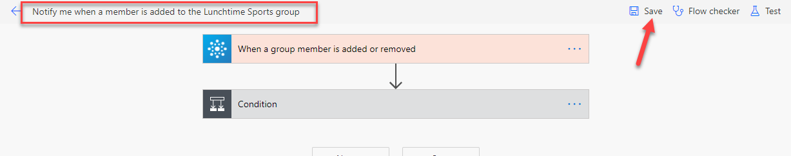


#### Задача 3. Тестировка потока
В этой задаче вы протестируете поток.

1. Перейдите в [Команды](https://teams.microsoft.com/).
2. Нажмите кнопку **... Дополнительные параметры** команды Lunchtime Sports и выберите **Управление командой**.

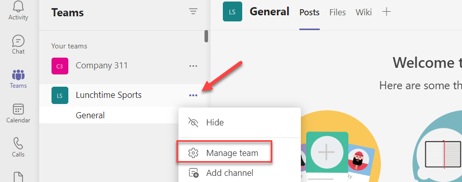

3. Щелкните **Добавить участника**.
4. Найдите и выберите пользователя, которого хотите использовать для тестирования.
5. нажмите **Добавить**.
6. Щелкните **Закрыть**.
7. Перейдите в [Outlook в Интернете](https://outlook.office.com/).
8. Вы должны получить уведомление по электронной почте. Откройте письмо с уведомлением.
9. Электронное письмо должно выглядеть как на изображении ниже.


#### Задача 4: Добавление потока в решение
В этой задаче вы добавите поток в решение «Компания 311».

1. Перейдите на [портал разработчика Power Apps](https://make.powerapps.com/) и убедитесь, что вы находитесь в правильной среде.
2. Выберите **Решения** и щелкните, чтобы открыть **Решения компании 311**.
3. Нажмите **+ Добавить существующий** и выберите **Облако**.
4. Выберите вкладку **Outside Dataverse**, выберите созданный поток и нажмите **Добавить**.

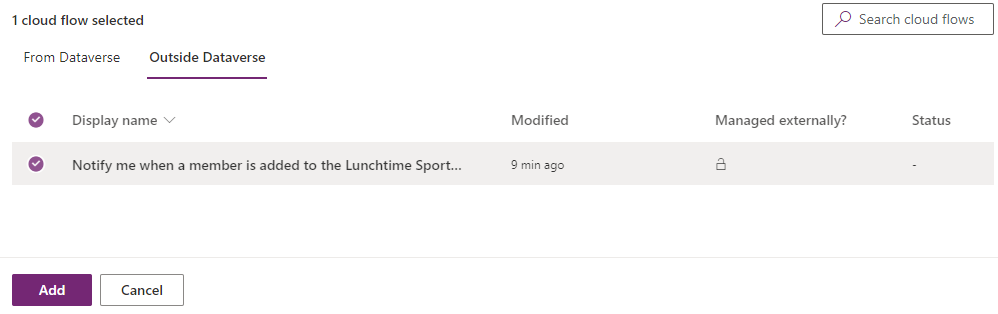

5. Щелкните **Опубликовать все настройки** и дождитесь завершения публикации.
6. Щелкните **Экспорт**.
7. Щелкните **Далее**.
8. Выберите **Управляемый** и нажмите **Экспорт**.
9. Дождитесь завершения экспорта и сохраните экспортированное решение на своем компьютере.
10. Еще раз нажмите **Экспорт**.
11. Щелкните **Далее**.
12. Выберите **Неуправляемый**, измените **версию** в соответствии с только что экспортированным управляемым решением и нажмите **Экспорт**.
13. Дождитесь завершения экспорта и сохраните экспортированное решение на вашем компьютере.

#### Задача 5: Импорт решения
В этой задаче вы импортируете решение в другую среду.

1. Перейдите на [портал разработчика Power Apps](https://make.powerapps.com/) и выберите среду **Prod**, которую вы создали в **упражнении 4, задание 2**.
2. Выберите **Решения** и нажмите **Импорт**.
3. Щелкните **Обзор**.
4. Выберите **управляемую** версию, которую вы только что экспортировали, и нажмите **Открыть**.
5. Щелкните **Далее**.
6. Вы должны получить сообщение **Этот пакет решения содержит обновление для уже установленного решения** щелкните **Импорт**.


7. Дождитесь завершения импорта решения.
15. Щелкните, чтобы открыть решение **Компания 311**.
16. Найдите поток, который вы добавили в решение, и щелкните, чтобы открыть его.

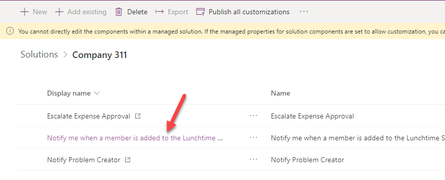

10. Щелкните **Изменить**.

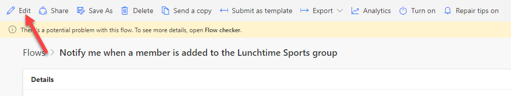

11. Щелкните, чтобы развернуть триггер.
12. Нажмите **+ Добавить новое соединение**.


13. Щелкните, чтобы развернуть условие.
14. Щелкните, чтобы развернуть первый шаг в ветке **Если да**.
15. Снова нажмите **+ Добавить новое соединение**.
16. Щелкните, чтобы развернуть последний шаг.
17. Нажмите **+ Добавить новое соединение** еще раз.
18. Нажмите **Сохранить** и дождитесь сохранения потока.
19. Нажмите кнопку **<-** назад.
20. Нажмите **Включить**.
21. Поток должен показать статус **Включен**. Вы можете проверить значение статуса в разделе «Подробности».
